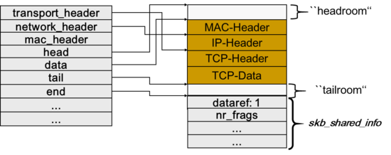
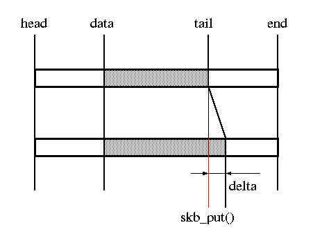
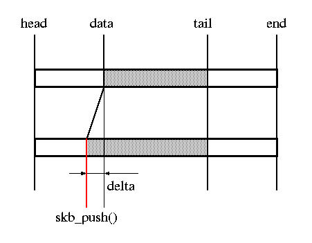
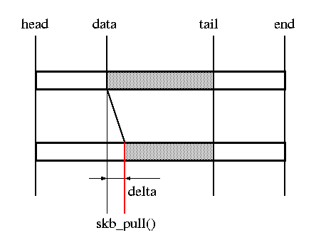
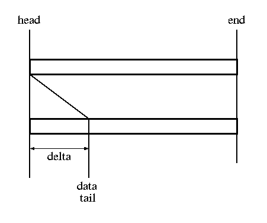

## sk_buff 구조 및 관련 함수 분석

### [ 자료구조 ]



- sk_buff는 크게 headroom, tailroom, 실제 데이터가 존재하는 영역으로 크게 3가지로 나뉨
- head: 데이터 영역의 시작
    - headroom의 시작
    - headroom은 head와 data 간격을 의미
    - skb 저장공간의 시작
- data: 현재 프로토콜의 데이터 시작
    - skb_push, skb_pull 함수를 통해 data를 각 프로토콜 시작지점으로 이동
- tail: 현재 프로토콜의 데이터 끝
    - skb가 할당된 시점에서는 data와 동일하고 각 프로토콜애서 데이터가 채워지면서 뒤로 이동
- end: 데이터 영역의 끝
    - tailroom은 tail과 end의 간격을 의미
- truesize: skb에 할당된 실제 사이즈(end - head)
- len: 현재 프로토콜의 데이터 사이즈

### [ 관련함수 ]

#### [ 주요함수 ]

- skb_clone: 실제 데이터는 그대로 두고 sk_buff 구조체만 복사
- skb_copy: sk_buff 구조체와 실제 데이터 모두 복사
    - 데이터를 변경할 때 사용
    - 패킷 데이터가 free되어도 영향받지 않는다
- alloc_skb: 새로운 sk_buff 할당
    - headroom과 data 영역은 0, tailroom은 len만큼 이동
- dev_alloc_skb: 새로운 sk_buff 할당
    - headroom에특정 사이즈를 할당

#### [ 데이터 버퍼 함수 ]

- skb_put: 실제 데이터를 len만큼 이동
    

    ```c
    void *skb_put(struct sk_buff *skb, unsigned int len)
    {
        void *tmp = skb_tail_pointer(skb);
        SKB_LINEAR_ASSERT(skb);
        skb->tail += len;
        skb->len  += len;
        if (unlikely(skb->tail > skb->end))
            skb_over_panic(skb, len, __builtin_return_address(0));
        return tmp;
    }
    ```
    - tail을 len만큼 증가시켜 data영역 증가
    - 현재 프로토콜에서 data를 추가하기위해 tail쪽 공각 확보
- skb_push: 데이터 앞부분을 len만큼 이동
    

    ```c
    void *skb_push(struct sk_buff *skb, unsigned int len)
    {
        skb->data -= len;
        skb->len  += len;
        if (unlikely(skb->data < skb->head))
            skb_under_panic(skb, len, __builtin_return_address(0));
        return skb->data;
    }
    ```
    - data를 len만큼 감소하여 data영역 증가
    - headroom 감소
    - layer가 낮은 쪽으로 이동할때(network_header -> mac_header)
- skb_pull: 데이터를 len만큼 뒤로 이동
    

    ```c
    static inline void *__skb_pull(struct sk_buff *skb, unsigned int len)
    {
        skb->len -= len;
        BUG_ON(skb->len < skb->data_len);
        return skb->data += len;
    }
    ```
    - data를 len만큼 증가하여 data영역 감소
    - headroom 증가
    - layer가 높은 쪽으로 이동(mac_header -> network_header)
- skb_reserve: data와 tail을 len만큼 이동
    

    ```c
    static inline void skb_reserve(struct sk_buff *skb, int len)
    {
        skb->data += len;
        skb->tail += len;
    }
    ```
    - headroom은 증가, tailroom은 감소
    - 버퍼가 빈 경우에만 사용
    - alloc_skb 직후 버퍼가 빈 상태에서 headroom을 확보하는 방식으로 사용

## [ 참고 사이트 ]

- <https://hand-over.tistory.com/11>
- <https://www.minzkn.com/moniwiki/wiki.php/skbuff>
- <https://hand-over.tistory.com/2>
- <http://www.skbuff.net/skbbasic.html>
